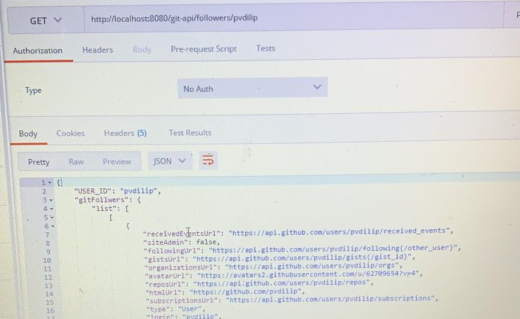

# Gitservice 

## Description
The purpose of the API endpoint is to get follower details upto 3 levels. API accepts a GitHub ID and returns Follower GitHub ID’s (up to 5 Followers total) associated with the passed in GitHub ID. Retrieve data up to 3 levels deep, repeating the process of retrieving Followers (up to 5 Followers total) for each Follower found. The result will be returned in JSON format.

## Technical Stack:

:Spring Boot
:Maven 
:STS 
:Java 8
:Packaging (JAR)
:RESTful

## How to Run 

This application is packaged as a jar which has Tomcat embedded. No Tomcat or JBoss installation is necessary. You run it using the ```java -jar``` command.

* Clone this repository 
* Make sure you are using JDK 1.8 and Maven 3.x
* You can build the project and run the tests by running ```mvn clean package```
* Once successfully built, you can run the service by one of these two methods:
```
        java -jar target/git-service-0.0.1-SNAPSHOT.jar
or
        mvn spring-boot:run 
```
* Check the stdout or boot_example.log file to make sure no exceptions are thrown

Once the application runs you should see something like this

```
2020-03-27 09:26:24.847  INFO 84564 --- [           main] o.s.b.w.embedded.tomcat.TomcatWebServer  : Tomcat started on port(s): 8080 (http) with context path ''
2020-03-27 09:26:24.852  INFO 84564 --- [           main] com.company.GitServiceApplication        : Started GitServiceApplication in 2.614 seconds (JVM running for 4.529)

```

## How does it work?
You can use the endpoints behind http://localhost:8080/git-api/followers/{gitid} to get the followers details.




